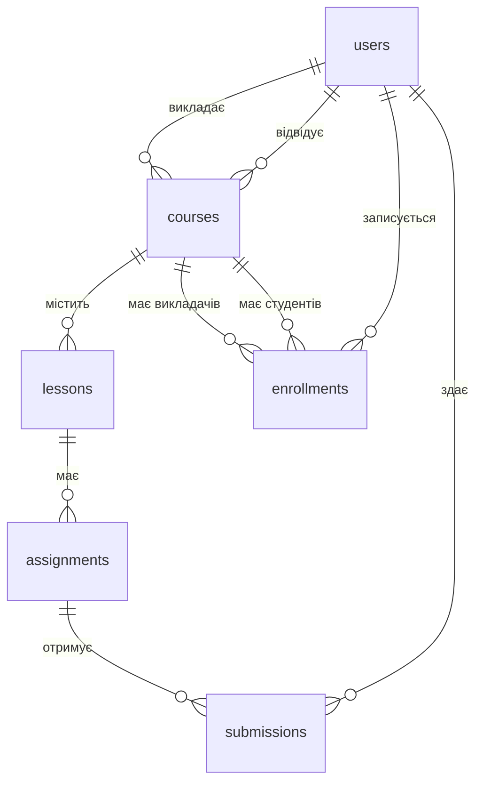

## Опис вимог словами замовника

> На платформі **викладачі** створюють **курси**. Курс складається з **уроків**. **Студенти** записуються на курси. До уроків додаються **завдання**. Студент може здати **відповідь** на завдання, а викладач виставляє **оцінку**.

| Сутність | Атрибути |
| -------- | -------- |
| Користувач | ім'я, прізвище, email, роль |
| Курс | назва, опис, викладач, опубліковано |
| Урок | назва, порядковий номер, зміст |
| Завдання | назва, макс. бал, дедлайн |
| Здача | текст відповіді, оцінка, дата |
| Запис на курс | студент, курс, дата, статус |

| Зв'язок | Тип | Як реалізуємо |
| ------- | --- | ------------- |
| Викладач → курси | 1 : N | `courses.teacher_id` |
| Курс → уроки | 1 : N | `lessons.course_id` |
| Урок → завдання | 1 : N | `assignments.lesson_id` |
| Студенти ↔ курси | M : N | таблиця `enrollments` |
| Студенти ↔ завдання | M : N | таблиця `submissions` |

| student_name | student_email | course_title | teacher_name | teacher_email | assignment | score |
| --- | --- | --- | --- | --- | --- | --- |
| Ірина Коваль | iryna@mail.com | Python | Петро Іваненко | petro@lms.ua | HW 1 | 90 |
| Ірина Коваль | iryna@mail.com | Python | Петро Іваненко | petro@lms.ua | HW 2 | 85 |
| Андрій Мельник | andrii@mail.com | Python | Петро Іваненко | petro@lms.ua | HW 1 | 70 |

# 1НФ 
| Ірина Коваль, iryna@mail.com |  Python, SQL| |
| --- | --- | --- |
| Ірина Коваль | iryna@mail.com |  Python |
| Ірина Коваль | iryna@mail.com |  SQL |

# 2НФ — немає часткових залежностей
ПРЕДМЕТИ
| ключ |  Курс  |
| --- | ---  |
| 1 | Python |
| 2 | SQL    |

СТУДЕНТИ
| Ключ | Студент імя прізвище |
| --- | ---  |
| 1 | Коваль Ірина |
| 2 | Петренко Ігор |

ЗАПИС
| ключ |  Курс ід | Студент ід | 
| --- | --- | --- |
| 1 | 1 | 1 |
| 2 | 1 | 2 |
| 3 | 2 | 2 |

# 3НФ — немає транзитивних залежностей

СТУДЕНТИ
| Ключ | Студент імя | прізвище |
| --- | --- |--- |
| 1 | Коваль | Ірина |
| 2 | Петренко | Ігор |





| У схемі | У SQL |
| ------- | ----- |
| Сутність | `CREATE TABLE` |
| Атрибут | колонка + тип даних |
| Ключ сутності | `PRIMARY KEY` |
| Зв'язок 1 : N | `FOREIGN KEY` на стороні «багато» |
| Зв'язок M : N | проміжна таблиця з двома `FOREIGN KEY` |
| Бізнес-правило | `NOT NULL`, `UNIQUE`, `CHECK`, `DEFAULT` |

| Поле | Тип | Чому |
| ---- | --- | ---- |
| `id` | `INTEGER` + `IDENTITY` | генерується автоматично |
| `id` | `UUID` | генерується автоматично |
| `email`, `title`, `content` | `TEXT` | довжина заздалегідь невідома |
| `phone` | `VARCHAR(20)` | довжина обмежена |
| `is_published` | `BOOLEAN` | так / ні |
| `score`, `position` | `INTEGER` | цілі числа |
| `created_at`, `due_date` | `TIMESTAMP` | дата і час |

| Рівень | Таблиці | Залежать від |
| ------ | ------- | ------------ |
| 1 | `users` | — |
| 2 | `courses` | `users` |
| 3 | `lessons`, `enrollments` | `courses`, `users` |
| 4 | `assignments` | `lessons` |
| 5 | `submissions` | `assignments`, `users` |

```sql
CREATE TABLE users (
    id         INTEGER GENERATED ALWAYS AS IDENTITY PRIMARY KEY,
    first_name TEXT NOT NULL,
    last_name  TEXT NOT NULL,
    email      TEXT NOT NULL UNIQUE,   -- без дублікатів
    -- студент чи викладач: інші значення заборонені
    role       TEXT NOT NULL CHECK (role IN ('student', 'teacher')),
    created_at TIMESTAMP NOT NULL DEFAULT CURRENT_TIMESTAMP
);
```
```sql
CREATE TABLE courses (
    id           INTEGER GENERATED ALWAYS AS IDENTITY PRIMARY KEY,
    title        TEXT NOT NULL,
    description  TEXT,                 -- може бути порожнім
    teacher_id   INTEGER NOT NULL,
    is_published BOOLEAN NOT NULL DEFAULT FALSE,
    created_at   TIMESTAMP NOT NULL DEFAULT CURRENT_TIMESTAMP,
    -- зв'язок 1:N: викладач → курси
    FOREIGN KEY (teacher_id) REFERENCES users(id)
);
```
```sql
CREATE TABLE lessons (
    id        INTEGER GENERATED ALWAYS AS IDENTITY PRIMARY KEY,
    course_id INTEGER NOT NULL,
    title     TEXT NOT NULL,
    position  INTEGER NOT NULL CHECK (position > 0),
    content   TEXT,
    FOREIGN KEY (course_id) REFERENCES courses(id),
    -- у межах курсу номер уроку не повторюється
    UNIQUE (course_id, position)
);

CREATE TABLE enrollments (
    user_id     INTEGER NOT NULL,
    course_id   INTEGER NOT NULL,
    enrolled_at TIMESTAMP NOT NULL DEFAULT CURRENT_TIMESTAMP,
    status      TEXT NOT NULL DEFAULT 'active'
                CHECK (status IN ('active', 'completed', 'dropped')),
    -- складений ключ: студент не запишеться на курс двічі
    PRIMARY KEY (user_id, course_id),
    FOREIGN KEY (user_id)   REFERENCES users(id),
    FOREIGN KEY (course_id) REFERENCES courses(id)
);
```
Тестуємо:
```sql
-- ✅ коректні дані
INSERT INTO users (first_name, last_name, email, role)
VALUES ('Петро', 'Іваненко', 'petro@lms.ua', 'teacher');

-- ❌ дубль email → порушення UNIQUE
INSERT INTO users (first_name, last_name, email, role)
VALUES ('Інший', 'Петро', 'petro@lms.ua', 'teacher');

-- ❌ роль 'admin' → порушення CHECK
INSERT INTO users (first_name, last_name, email, role)
VALUES ('Ірина', 'Коваль', 'iryna@lms.ua', 'admin');

-- ❌ викладача 999 не існує → порушення FOREIGN KEY
INSERT INTO courses (title, teacher_id) VALUES ('SQL', 999);
```

```sql
-- додати колонку
ALTER TABLE users ADD COLUMN phone TEXT;

-- змінити тип даних
ALTER TABLE users ALTER COLUMN phone TYPE VARCHAR(20);

-- додати обмеження (з іменем, щоб потім можна було видалити)
ALTER TABLE courses ADD CONSTRAINT unique_course_title UNIQUE (title);

-- видалити обмеження
ALTER TABLE courses DROP CONSTRAINT unique_course_title;

-- видалити колонку
ALTER TABLE users DROP COLUMN phone;
```

```sql
-- 1 зробити нову таблицю для даних
CREATE TABLE ext_users (
    user_id  FOREIGN KEY (id) REFERENCES users(id)      
    phone_num VARCHAR(20)
);
-- 2 копіювати частину даних із існуючої в нову
INSERT INTO ext_users
values (
    select id, phone FROM users
);
-- 3 видалити у старій таблиці
ALTER TABLE users DROP COLUMN phone;
```
