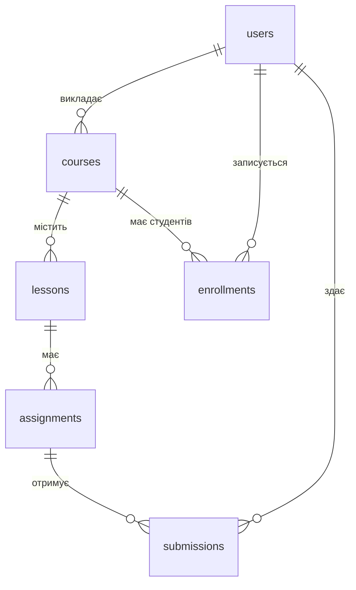

```layout
1
```
# Заняття 33. DDL та розробка структури бази даних
## Від вимог до таблиць PostgreSQL на прикладі LMS
Курс «Програмування Python»
---
```layout
3
```
# Мета заняття
## Наскрізний приклад — навчальна платформа (LMS)

Сьогодні ми пройдемо весь шлях проєктування БД на одному прикладі:

1. **Аналіз** — з вимог до сутностей і зв'язків
2. **Нормалізація** — від «одної великої таблиці» до 3НФ
3. **DDL** — `CREATE`, `ALTER`, `DROP`
4. **Створення** таблиць LMS у PostgreSQL
5. **Перевірка** обмежень тестовими даними
6. **Те саме** — для вашого проєкту
---
```layout
3
```
# Що таке DDL
## Мова визначення даних

DDL (Data Definition Language) працює **зі структурою**, а не з даними: таблицями, індексами, схемами, обмеженнями.

| Команда | Призначення |
| ------- | ----------- |
| `CREATE` | Створити об'єкт |
| `ALTER`  | Змінити об'єкт |
| `DROP`   | Видалити об'єкт |

Спочатку проєктуємо на папері, потім переносимо схему в DDL.
---
```layout
3
```
# Задача: LMS
## Опис вимог словами замовника

> На платформі **викладачі** створюють **курси**. Курс складається з **уроків**. **Студенти** записуються на курси. До уроків додаються **завдання**. Студент може здати **відповідь** на завдання, а викладач виставляє **оцінку**.

Наше завдання — перетворити цей текст на структуру БД.
---
```layout
3
```
# Крок 1. Аналіз вимог
## Як знайти сутності, атрибути й зв'язки

- **Іменники** → кандидати в сутності (таблиці)
- **Властивості** сутності → атрибути (колонки)
- **Дієслова** між іменниками → зв'язки
- Для кожного зв'язку питаємо: «Скільки?» з обох боків
- Для кожної сутності питаємо: «Як відрізнити один запис від іншого?» → ключ
---
```layout
3
```
# Крок 1. Результат аналізу LMS
## Сутності та їхні атрибути

| Сутність | Атрибути |
| -------- | -------- |
| Користувач | ім'я, прізвище, email, роль |
| Курс | назва, опис, викладач, опубліковано |
| Урок | назва, порядковий номер, зміст |
| Завдання | назва, макс. бал, дедлайн |
| Здача | текст відповіді, оцінка, дата |
| Запис на курс | студент, курс, дата, статус |
---
```layout
3
```
# Крок 2. Зв'язки між сутностями
## Три типи зв'язків

- **1 : N** — один викладач має багато курсів
- **M : N** — студент проходить багато курсів, на курсі багато студентів
- **1 : 1** — трапляється рідко, часто це одна таблиця

Правило реалізації:

- 1 : N → зовнішній ключ на стороні «багато»
- M : N → **проміжна таблиця**
---
```layout
3
```
# Крок 2. Зв'язки в LMS

| Зв'язок | Тип | Як реалізуємо |
| ------- | --- | ------------- |
| Викладач → курси | 1 : N | `courses.teacher_id` |
| Курс → уроки | 1 : N | `lessons.course_id` |
| Урок → завдання | 1 : N | `assignments.lesson_id` |
| Студенти ↔ курси | M : N | таблиця `enrollments` |
| Студенти ↔ завдання | M : N | таблиця `submissions` |
---
```layout
3
```
# Крок 3. Нормалізація
## Починаємо з «поганої» таблиці

Так виглядає журнал, який зробили в Excel (`lms_journal`):

| student_name | student_email | course_title | teacher_name | teacher_email | assignment | score |
| --- | --- | --- | --- | --- | --- | --- |
| Ірина Коваль | iryna@mail.com | Python | Петро Іваненко | petro@lms.ua | HW 1 | 90 |
| Ірина Коваль | iryna@mail.com | Python | Петро Іваненко | petro@lms.ua | HW 2 | 85 |
| Андрій Мельник | andrii@mail.com | Python | Петро Іваненко | petro@lms.ua | HW 1 | 70 |

Ключ: `(student_email, assignment)`
---
```layout
3
```
# Які проблеми в цій таблиці
## Аномалії

- **Оновлення**: змінився email викладача → треба виправити всі рядки, один пропустили — дані суперечать
- **Вставка**: не можна додати нового студента, поки він не здав жодного завдання
- **Видалення**: видалили єдину здачу курсу → зникла інформація про курс і викладача
- **Дублювання**: ім'я викладача повторюється в кожному рядку
---
```layout
3
```
# 1НФ — атомарність значень
## Одна клітинка — одне значення

Погано: список в одному полі.

| student_email | course_title |
| ------------- | ------------ |
| iryna@mail.com | Python, SQL |

Добре: окремий рядок для кожного значення.

| student_email | course_title |
| ------------- | ------------ |
| iryna@mail.com | Python |
| iryna@mail.com | SQL |

Наш журнал уже в 1НФ.
---
```layout
3
```
# 2НФ — немає часткових залежностей
## Кожне поле залежить від усього ключа

Ключ: `(student_email, assignment)`

- `student_name` залежить лише від `student_email` ❌
- `course_title`, `teacher_*` залежать лише від `assignment` ❌
- `score` залежить від обох частин ключа ✅

Виносимо в окремі таблиці:

- `students(student_email, student_name)`
- `assignments(assignment, course_title, teacher_name, teacher_email)`
- `submissions(student_email, assignment, score)`
---
```layout
3
```
# 3НФ — немає транзитивних залежностей
## Поля залежать від ключа, а не одне від одного

У `assignments`: `assignment → course_title → teacher_name, teacher_email`

Викладач залежить від курсу, а не від завдання. Виносимо:

- `teachers(teacher_email, teacher_name)`
- `courses(course_title, teacher_email)`
- `assignments(assignment, course_title)`

Тепер зміна email викладача — це **один** рядок в одній таблиці.
---
```layout
3
```
# Крок 3. Доводимо схему до практичної
## Три доопрацювання після 3НФ

1. **Сурогатні ключі**: замість `email` чи `title` — `id` (назва курсу може змінитись)
2. **Об'єднання**: студенти й викладачі — це користувачі → одна таблиця `users` з полем `role`
3. **Нова сутність**: запис студента на курс має існувати **окремо** від здачі завдань → `enrollments`
4. **Додаємо**: `lessons` між курсом і завданням

Результат: 6 таблиць замість однієї.
---
```layout
3
```
# Перевірка таблиці
## Чек-ліст після нормалізації

Для кожної таблиці відповідаємо:

- Є первинний ключ?
- Кожна колонка описує саме цю сутність?
- Немає списків в одній клітинці?
- Дані не повторюються в багатьох рядках?
- Кожен зв'язок має зовнішній ключ або проміжну таблицю?
---
```layout
4
```
# Схема LMS (ER-діаграма)
## Результат кроків 1–3


---
```layout
3
```
# Крок 4. Від схеми до SQL
## Таблиця відповідності

| У схемі | У SQL |
| ------- | ----- |
| Сутність | `CREATE TABLE` |
| Атрибут | колонка + тип даних |
| Ключ сутності | `PRIMARY KEY` |
| Зв'язок 1 : N | `FOREIGN KEY` на стороні «багато» |
| Зв'язок M : N | проміжна таблиця з двома `FOREIGN KEY` |
| Бізнес-правило | `NOT NULL`, `UNIQUE`, `CHECK`, `DEFAULT` |
---
```layout
3
```
# Типи даних для LMS
## Вибираємо тип під зміст поля

| Поле | Тип | Чому |
| ---- | --- | ---- |
| `id` | `INTEGER` + `IDENTITY` | генерується автоматично |
| `email`, `title`, `content` | `TEXT` | довжина заздалегідь невідома |
| `phone` | `VARCHAR(20)` | довжина обмежена |
| `is_published` | `BOOLEAN` | так / ні |
| `score`, `position` | `INTEGER` | цілі числа |
| `created_at`, `due_date` | `TIMESTAMP` | дата і час |
---
```layout
3
```
# Обмеження (constraints)
## Правила, які база перевіряє за нас

| Обмеження | Що робить | Приклад в LMS |
| --------- | --------- | ------------- |
| `PRIMARY KEY` | унікальний, не `NULL` | `users.id` |
| `GENERATED ALWAYS AS IDENTITY` | автоматичний id | `users.id` |
| `NOT NULL` | забороняє порожнє значення | `users.first_name` |
| `UNIQUE` | забороняє дублікати | `users.email` |
| `DEFAULT` | значення за замовчуванням | `is_published = FALSE` |
| `CHECK` | перевіряє умову | `score >= 0` |
| `FOREIGN KEY` | посилання на іншу таблицю | `courses.teacher_id` |
---
```layout
3
```
# Порядок створення таблиць
## Спочатку незалежні, потім залежні

Зовнішній ключ може посилатися лише на **вже існуючу** таблицю.

| Рівень | Таблиці | Залежать від |
| ------ | ------- | ------------ |
| 1 | `users` | — |
| 2 | `courses` | `users` |
| 3 | `lessons`, `enrollments` | `courses`, `users` |
| 4 | `assignments` | `lessons` |
| 5 | `submissions` | `assignments`, `users` |
---
```layout
4
```
# CREATE TABLE users
## Рівень 1: незалежна таблиця

```sql
CREATE TABLE users (
    id         INTEGER GENERATED ALWAYS AS IDENTITY PRIMARY KEY,
    first_name TEXT NOT NULL,
    last_name  TEXT NOT NULL,
    email      TEXT NOT NULL UNIQUE,   -- без дублікатів
    -- студент чи викладач: інші значення заборонені
    role       TEXT NOT NULL CHECK (role IN ('student', 'teacher')),
    created_at TIMESTAMP NOT NULL DEFAULT CURRENT_TIMESTAMP
);
```
---
```layout
9
```
# CREATE TABLE courses
## Рівень 2: перший зовнішній ключ

```sql
CREATE TABLE courses (
    id           INTEGER GENERATED ALWAYS AS IDENTITY PRIMARY KEY,
    title        TEXT NOT NULL,
    description  TEXT,                 -- може бути порожнім
    teacher_id   INTEGER NOT NULL,
    is_published BOOLEAN NOT NULL DEFAULT FALSE,
    created_at   TIMESTAMP NOT NULL DEFAULT CURRENT_TIMESTAMP,
    -- зв'язок 1:N: викладач → курси
    FOREIGN KEY (teacher_id) REFERENCES users(id)
);
```
---
```layout
9
```
# CREATE TABLE lessons
## Рівень 3: порядок уроків у курсі

```sql
CREATE TABLE lessons (
    id        INTEGER GENERATED ALWAYS AS IDENTITY PRIMARY KEY,
    course_id INTEGER NOT NULL,
    title     TEXT NOT NULL,
    position  INTEGER NOT NULL CHECK (position > 0),
    content   TEXT,
    FOREIGN KEY (course_id) REFERENCES courses(id),
    -- у межах курсу номер уроку не повторюється
    UNIQUE (course_id, position)
);
```
---
```layout
9
```
# CREATE TABLE enrollments
## Рівень 3: проміжна таблиця для M : N

```sql
CREATE TABLE enrollments (
    user_id     INTEGER NOT NULL,
    course_id   INTEGER NOT NULL,
    enrolled_at TIMESTAMP NOT NULL DEFAULT CURRENT_TIMESTAMP,
    status      TEXT NOT NULL DEFAULT 'active'
                CHECK (status IN ('active', 'completed', 'dropped')),
    -- складений ключ: студент не запишеться на курс двічі
    PRIMARY KEY (user_id, course_id),
    FOREIGN KEY (user_id)   REFERENCES users(id),
    FOREIGN KEY (course_id) REFERENCES courses(id)
);
```
---
```layout
9
```
# CREATE TABLE assignments
## Рівень 4: завдання до уроку

```sql
CREATE TABLE assignments (
    id        INTEGER GENERATED ALWAYS AS IDENTITY PRIMARY KEY,
    lesson_id INTEGER NOT NULL,
    title     TEXT NOT NULL,
    max_score INTEGER NOT NULL DEFAULT 100 CHECK (max_score > 0),
    due_date  TIMESTAMP,              -- дедлайн необов'язковий
    FOREIGN KEY (lesson_id) REFERENCES lessons(id)
);
```
---
```layout
9
```
# CREATE TABLE submissions
## Рівень 5: здачі завдань

```sql
CREATE TABLE submissions (
    id            INTEGER GENERATED ALWAYS AS IDENTITY PRIMARY KEY,
    assignment_id INTEGER NOT NULL,
    student_id    INTEGER NOT NULL,
    answer_text   TEXT,
    score         INTEGER CHECK (score >= 0),  -- NULL, поки не оцінено
    submitted_at  TIMESTAMP NOT NULL DEFAULT CURRENT_TIMESTAMP,
    FOREIGN KEY (assignment_id) REFERENCES assignments(id),
    FOREIGN KEY (student_id)    REFERENCES users(id),
    UNIQUE (assignment_id, student_id)   -- одна здача на студента
);
```
---
```layout
3
```
# Перевірка: що вийшло
## Структуру перевіряємо в psql

- `\dt` — список таблиць (має бути 6)
- `\d courses` — колонки, ключі, обмеження таблиці
- Перевірте, що всі `FOREIGN KEY` видно в блоці *Foreign-key constraints*

Далі перевіряємо, що обмеження **реально працюють** — мислимо як тестувальники: і позитивні, і негативні сценарії.
---
```layout
4
```
# Тестуємо обмеження
## Позитивний і негативні сценарії

```sql
-- ✅ коректні дані
INSERT INTO users (first_name, last_name, email, role)
VALUES ('Петро', 'Іваненко', 'petro@lms.ua', 'teacher');

-- ❌ дубль email → порушення UNIQUE
INSERT INTO users (first_name, last_name, email, role)
VALUES ('Інший', 'Петро', 'petro@lms.ua', 'teacher');

-- ❌ роль 'admin' → порушення CHECK
INSERT INTO users (first_name, last_name, email, role)
VALUES ('Ірина', 'Коваль', 'iryna@lms.ua', 'admin');

-- ❌ викладача 999 не існує → порушення FOREIGN KEY
INSERT INTO courses (title, teacher_id) VALUES ('SQL', 999);
```
---
```layout
3
```
# ALTER TABLE
## Вимоги змінилися — структура теж

Нове побажання замовника: зберігати телефон користувача і заборонити курси з однаковою назвою.

`ALTER TABLE` дозволяє:

- додати або видалити колонку
- змінити тип даних
- додати або видалити обмеження

Таблицю **не потрібно** створювати заново, дані зберігаються.
---
```layout
4
```
# ALTER TABLE на прикладі LMS
## Типові зміни структури

```sql
-- додати колонку
ALTER TABLE users ADD COLUMN phone TEXT;

-- змінити тип даних
ALTER TABLE users ALTER COLUMN phone TYPE VARCHAR(20);

-- додати обмеження (з іменем, щоб потім можна було видалити)
ALTER TABLE courses ADD CONSTRAINT unique_course_title UNIQUE (title);

-- видалити обмеження
ALTER TABLE courses DROP CONSTRAINT unique_course_title;

-- видалити колонку
ALTER TABLE users DROP COLUMN phone;
```
---
```layout
3
```
# DROP TABLE
## Видалення таблиць

`DROP TABLE` видаляє таблицю **разом з даними** безповоротно.

- `DROP TABLE IF EXISTS` — без помилки, якщо таблиці немає
- Залежні таблиці видаляємо **першими**: порядок зворотний до створення
- `users` не можна видалити, поки на неї посилається `courses`
- `CASCADE` видаляє й залежні об'єкти — використовуйте лише на навчальній БД
---
```layout
4
```
# Скрипт, який можна запускати повторно
## Початок файлу schema.sql

```sql
-- Спочатку залежні таблиці, потім незалежні
DROP TABLE IF EXISTS submissions;
DROP TABLE IF EXISTS assignments;
DROP TABLE IF EXISTS enrollments;
DROP TABLE IF EXISTS lessons;
DROP TABLE IF EXISTS courses;
DROP TABLE IF EXISTS users;

-- Далі йдуть CREATE TABLE у прямому порядку:
-- users, courses, lessons, enrollments, assignments, submissions
```
---
```layout
3
```
# Типові помилки
## Що ламає цілісність даних

| Помилка | Наслідок | Як правильно |
| ------- | -------- | ------------ |
| Немає `PRIMARY KEY` | не відрізнити рядки | ключ у кожній таблиці |
| `user_id INTEGER` без `FOREIGN KEY` | «сирітські» записи | `REFERENCES users(id)` |
| `email TEXT` без обмежень | дублі й порожні значення | `UNIQUE NOT NULL` |
| `DROP` у неправильному порядку | помилка залежності | спочатку залежні таблиці |
| Список у одному полі | порушення 1НФ | окремі рядки або таблиця |
---
```layout
3
```
# Межі можливостей CHECK
## Що не вирішується обмеженнями колонки

`CHECK` бачить лише поля **свого рядка**.

Приклад: `submissions.score` не можна порівняти з `assignments.max_score` — це інша таблиця.

Такі правила перевіряють:

- у коді застосунку (Python)
- або тригером у базі (тема наступних занять)

Знати межі інструмента — частина проєктування.
---
```layout
3
```
# Практика 1. Розширюємо LMS
## Вправа разом із викладачем

Замовник просить додати **категорії курсів**: курс може мати кілька категорій, категорія — багато курсів.

1. Яка це сутність, які в неї атрибути?
2. Який тип зв'язку з `courses`?
3. Яка таблиця потрібна?
4. Який у неї первинний ключ?
5. Напишіть `CREATE TABLE` і додайте у `schema.sql` у правильному порядку
---
```layout
3
```
# Практика 2. Ваш проєкт
## Повторіть увесь шлях для власної БД

1. Опишіть вимоги 5–7 реченнями
2. Виділіть сутності та атрибути
3. Визначте зв'язки (1 : N, M : N)
4. Доведіть таблиці до 3НФ, намалюйте ER-діаграму
5. Напишіть `schema.sql` з `DROP` на початку
6. Протестуйте обмеження: 1 позитивний і 3 негативні `INSERT`
---
```layout
3
```
# Чек-ліст здачі
## Перед відправкою проєкту перевірте

- У кожної таблиці є `PRIMARY KEY`
- Усі зв'язки реалізовано через `FOREIGN KEY`
- M : N реалізовано проміжною таблицею
- `NOT NULL` і `UNIQUE` стоять там, де це потрібно
- `CHECK` є для числових полів
- Скрипт виконується з нуля без помилок
- Є ER-діаграма і тестові `INSERT`
---
```layout
13
```
# Підсумок
## Що ми дізнались сьогодні

- Аналіз вимог: іменники → таблиці, дієслова → зв'язки
- Нормалізація 1НФ → 2НФ → 3НФ прибирає дублювання й аномалії
- DDL: `CREATE`, `ALTER`, `DROP`
- Обмеження захищають цілісність даних на рівні бази
- Таблиці створюємо у порядку залежностей, видаляємо у зворотному
- Структуру обов'язково тестуємо негативними сценаріями
---
```layout
10
```
# Далі: наповнюємо базу даними
